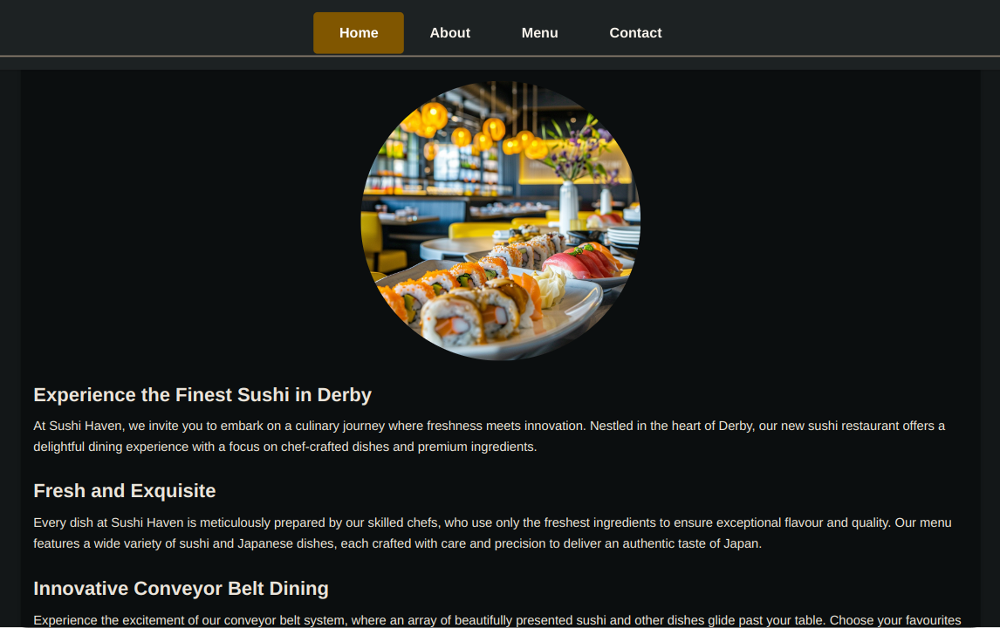

# Sushi Restaurant

Welcome to **Sushi Restaurant**! This project is a modern web application showcasing a sushi restaurant with detailed content and interactive elements.

## Overview

Sushi Restaurant offers an engaging and visually appealing way to explore sushi dishes and restaurant information. The website includes sections for the home page, menu, about us, and contact details, each featuring vibrant images and well-structured content.

## Features

- **Home Page**: Introduction to Sushi Restaurant with a welcoming message.
- **Menu Page**: A list of menu items with descriptions and prices, each featuring an image.
- **About Page**: Information about the restaurant's story, team, and philosophy.
- **Contact Page**: Contact details and social media links.

## Screenshots

Here’s a glimpse of the project:



## Installation

To get a local copy up and running, follow these steps:

1. **Clone the Repository**:

   ```bash
   git clone https://github.com/yourusername/sushi-restaurant.git
